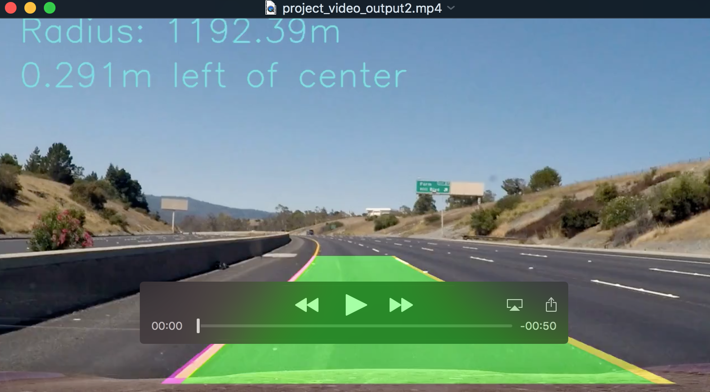

**Advanced Lane Finding Project**

The goals / steps of this project are the following:

* Compute the camera calibration matrix and distortion coefficients given a set of chessboard images.
* Apply a distortion correction to raw images.
* Use color transforms, gradients, etc., to create a thresholded binary image.
* Apply a perspective transform to rectify binary image ("birds-eye view").
* Detect lane pixels and fit to find the lane boundary.
* Determine the curvature of the lane and vehicle position with respect to center.
* Warp the detected lane boundaries back onto the original image.
* Output visual display of the lane boundaries and numerical estimation of lane curvature and vehicle position.

[//]: # (Image References)
[imgcalib]: ./output_images/calib_pics.jpg "Chessboard Undistorted"
[imgroad]: ./test_images/straight_lines1.jpg "Road"
[imgwarp]: ./output_images/straight1-warp-compare.png "Warped"
[imgbin]: ./output_images/straight1_bin.jpg "Binary"
[imgformula]: ./formula-for-radius.png "Radius Formula"
[video1]: ./project_video.mp4 "Video"


### Camera Calibration

#### 1. Briefly state how you computed the camera matrix and distortion coefficients. Provide an example of a distortion corrected calibration image.

The code for this step is contained in the first code cell of the IPython notebook located in "./adv-line.ipynb".

I start by preparing "object points", which will be the (x, y, z) coordinates of the chessboard corners in the world. Here I am assuming the chessboard is fixed on the (x, y) plane at z=0, such that the object points are the same for each calibration image.  Thus, `objp` is just a replicated array of coordinates, and `object_points` will be appended with a copy of it every time I successfully detect all chessboard corners in a test image.  `image_points` will be appended with the (x, y) pixel position of each of the corners in the image plane with each successful chessboard detection.  

I then used the output `object_points` and `image_points` to compute the camera calibration and distortion coefficients using the `cv2.calibrateCamera()` function.  I applied this distortion correction to the test image using the `cv2.undistort()` function and obtained this result: 


### Pipeline (single images)

#### 1. Provide an example of a distortion-corrected image.

To demonstrate this step, I will describe how I apply the distortion correction to one of the test images like this one:

![imgcalib][imgcalib]


#### 2. Describe how you performed a perspective transform and provide an example of a transformed image.

The code for my perspective transform includes a function called `unwarp()`, which is in the 4th code cell of the IPython notebook).  The `unwarp()` function takes as inputs an image (`img`), as well as source (`src`) and destination (`dst`) points.  I chose the hardcode the source and destination points in the following manner:

```python
    src = np.float32([(570,465),
                  (705,465), 
                  (250,685), 
                  (1040,685)])
    dst = np.float32([(450,0),
                  (w-450,0),
                  (450,h),
                  (w-450,h)])
    
```

I verified that my perspective transform was working as expected by drawing the `src` and `dst` points onto a test image and its warped counterpart to verify that the lines appear parallel in the warped image.

![Warped results][imgwarp]


#### 3. Describe how (and identify where in your code) you used color transforms, gradients or other methods to create a thresholded binary image. Provide an example of a binary image result.

I used a combination of color and gradient thresholds to generate a binary image. After multiple experiments I fixed to use several converted results combining together which seems the best solution to reduce the noise while preserve the shape of lanes as much as possible. 

![Binary Form][imgbin]

#### 4. Describe how (and identify where in your code) you identified lane-line pixels and fit their positions with a polynomial?

With the binary results, now search the image to find the two lanes and compute the continuous lines using second order poly fit from the binary images.

1, Separate the searching slots to 10 windows. Calculate the mean value of non-zero points to recenter next window.

2, The points in the windows will be used to find the best second order polynomial to fit the two lane lines

3, The first time I tried with directly using the fits computed from current images, if there is no fit, the lane won't be drawed green. The second try was to keep one fit computed, if there is no fit found in current image, we assumed the saved fit still apply (in method drawLane2). The third try(in method drawLane3) was to save up to 5-8 fits and use the average of these fits as best fit no matter whether current fit was found or not. By this way we could get a more stablized lane drawed on video images. 

#### 5. Describe how (and identify where in your code) you calculated the radius of curvature of the lane and the position of the vehicle with respect to center.

The real distance is a multiply to the pixel distance on image. Using the multiply provided at the class. When the second order polynomial is computed, for this one: y = Ax^2 + Bx + C, we compute the radius using this formula:
![Radius Formula][imgformula]


---

### Pipeline (video)

#### 1. Provide a link to your final video output.  Your pipeline should perform reasonably well on the entire project video (wobbly lines are ok but no catastrophic failures that would cause the car to drive off the road!).

Here's a [](./project_video.mp4)

---

### Discussion

#### 1. Briefly discuss any problems / issues you faced in your implementation of this project.  Where will your pipeline likely fail?  What could you do to make it more robust?

How to preserve previous fits and use them to guide lane marking on current image seems could make significant difference. I believe there are some spaces for improvement in this area, e.g. using fits computed from images within a time frame like 0.5 second instead simply saving previous results up to a limit could be helpful. 

There are many ways to convert an image to binary. I had to try and tune many different combinationa in color space, color channel, thresholds, and the scope to unwarp. These works are tedious and hard to tell which one better than the other, and even some did work well, we still could not get the confidence that how these parameters work for different video. In such problems, machine learning approach should be able to perform better and easier to implement.
